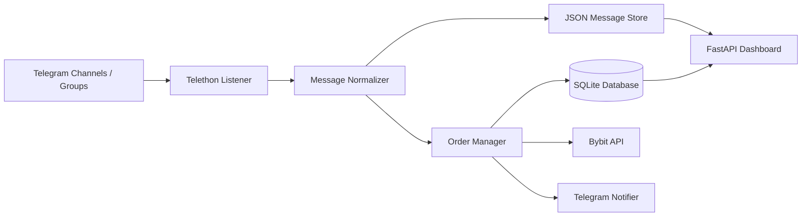
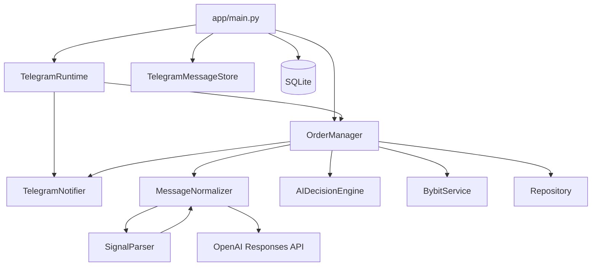
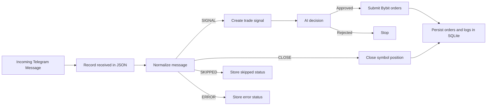
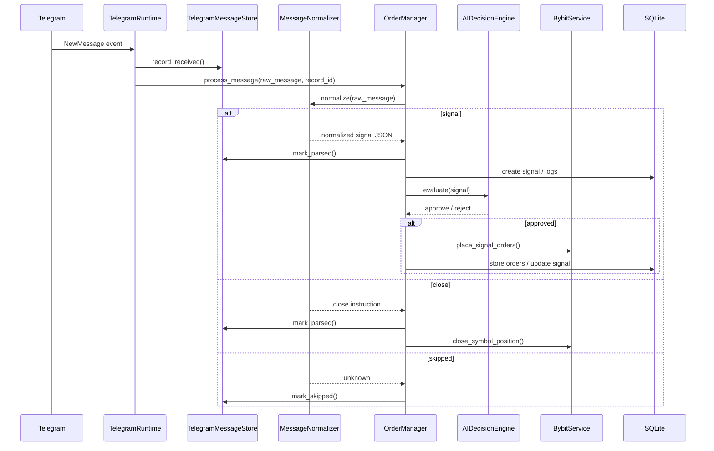
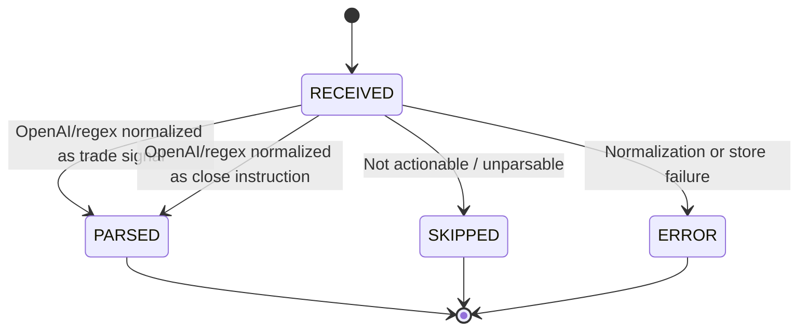
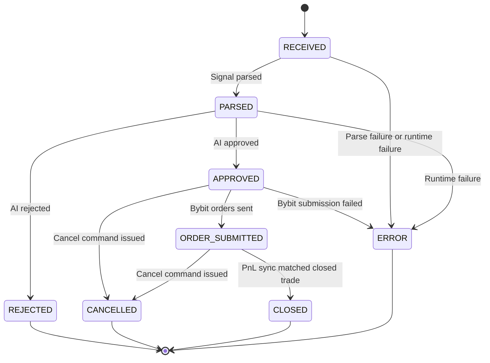
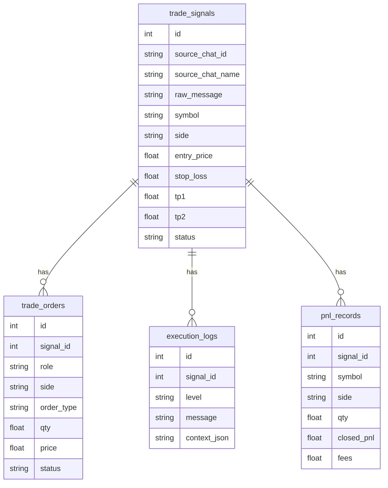

# GroupTrade Architecture

## Overview

The system listens to Telegram source chats, normalizes incoming messages, stores message state in JSON, keeps trade execution history in SQLite, and exposes a localhost dashboard.

## Block Diagram

## Structure Diagram

## Data Flow

## Sequence Diagram

## State Machine

### Telegram Message Lifecycle

### Trade Signal Lifecycle

## Data Model

## Runtime Components

| Component | Responsibility |
| --- | --- |
| `TelegramRuntime` | Starts Telethon listener, Telegram bot commands, and sync loop |
| `MessageNormalizer` | Converts raw Telegram text into a normalized JSON-like object |
| `TelegramMessageStore` | Stores receive/parse/skip/error state in JSON |
| `OrderManager` | Controls parsing, AI decision, order submission, and error handling |
| `Repository` | Reads/writes SQLite trade data |
| `BybitService` | Places, cancels, and closes futures orders |
| `AIDecisionEngine` | Filters signals before execution |
